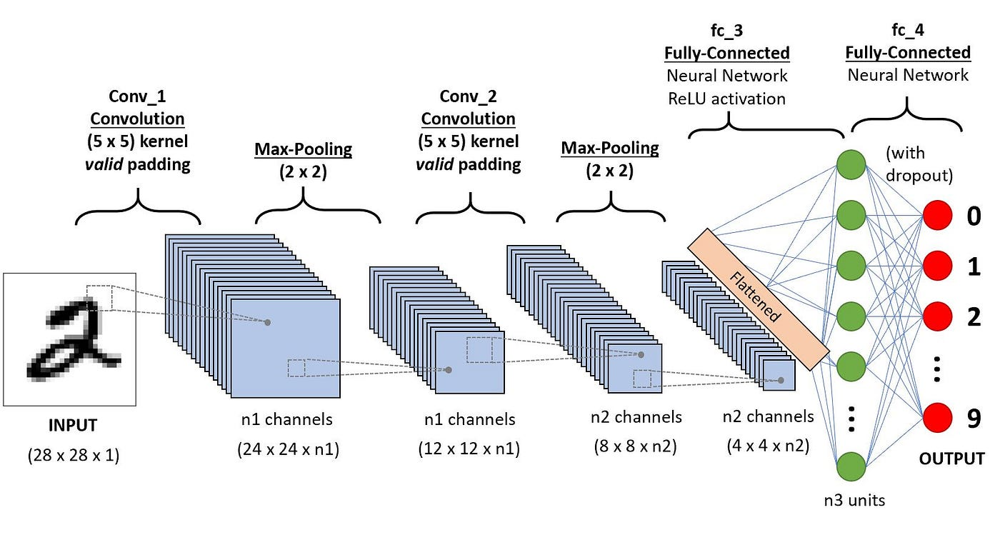

# OpenCV_Course
Code from following along this [OpenCV Course](https://www.youtube.com/watch?v=oXlwWbU8l2o).

Note: Before using `17_simpsons_tensorflow.ipynb` or `17_simpsons_keras2.ipynb`:
- download the simpsons dataset from Kaggle https://www.kaggle.com/datasets/alexattia/the-simpsons-characters-dataset
- unzip it to a folder named `simpsons_data` in the cloned version of this repo
- Ensure the dataset folder path is as such `./simpsons_data/simpsons_dataset/`

## Packages

Packages Needed:
```
pip install opencv-contrib-python
pip install caer
pip install matplotlib
pip install canaro
```

In order for tensorflow to detect the GPU:
```
pip uninstall tensorflow
pip install tensorflow[and-cuda]
```

At some point, `LBPHFaceRecognizer_create` wasnt working, so I uninstalled and reinstalled packages as such:
```
pip uninstall opencv-python
pip uninstall opencv-python-headless
pip uninstall opencv-contrib-python
pip uninstall caer

pip install opencv-contrib-python
pip install caer
```

## Links
- https://www.tensorflow.org/install/pip#linux_setup

Neural Network Explainations:
- https://setosa.io/ev/image-kernels/
- https://poloclub.github.io/cnn-explainer/

